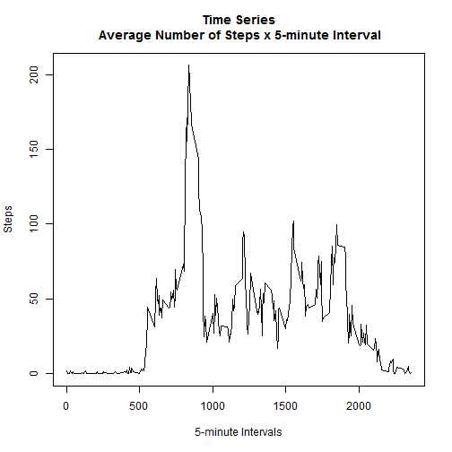
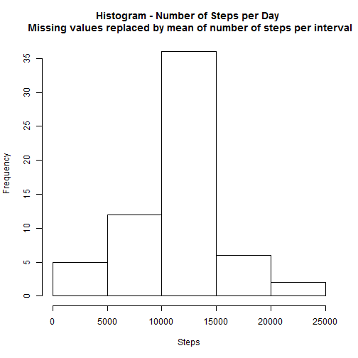
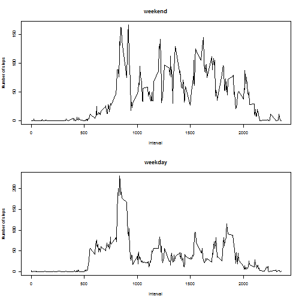

 Personal Activity Monitoring Analysis
======================================= 

This reports analises the personal activity of an anonymous individual throught a monitoring device. This device collects number of steps taken at 5 minute intervals through out the day, during the months of October and November, 2012. The data for this analysis can be found at https://github.com/rdpeng/RepData_PeerAssessment1

### Loading and preprocessing the data


```r
if(!file.exists("activity.csv")){
    unzip("activity.zip")
}

csvfile <- "activity.csv"
act_df <- read.csv(csvfile, header = TRUE)
summary(act_df)
```

```
##      steps                date          interval     
##  Min.   :  0.00   2012-10-01:  288   Min.   :   0.0  
##  1st Qu.:  0.00   2012-10-02:  288   1st Qu.: 588.8  
##  Median :  0.00   2012-10-03:  288   Median :1177.5  
##  Mean   : 37.38   2012-10-04:  288   Mean   :1177.5  
##  3rd Qu.: 12.00   2012-10-05:  288   3rd Qu.:1766.2  
##  Max.   :806.00   2012-10-06:  288   Max.   :2355.0  
##  NA's   :2304     (Other)   :15840
```

```r
head(act_df)
```

```
##   steps       date interval
## 1    NA 2012-10-01        0
## 2    NA 2012-10-01        5
## 3    NA 2012-10-01       10
## 4    NA 2012-10-01       15
## 5    NA 2012-10-01       20
## 6    NA 2012-10-01       25
```

### Computing mean total number of steps taken per day

1- Total number of steps per day

```r
steps_df <- aggregate(steps ~ date, data = act_df, sum, na.rm = TRUE)
head(steps_df)
```

```
##         date steps
## 1 2012-10-02   126
## 2 2012-10-03 11352
## 3 2012-10-04 12116
## 4 2012-10-05 13294
## 5 2012-10-06 15420
## 6 2012-10-07 11015
```

2- Histograma number of steps per day

```r
hist(steps_df$steps, main = "Histogram\n Average Number of Steps per Day", xlab = "Steps")
```

 

3- Mean and median of the total number of steps taken per day

```r
meanSteps <- mean(steps_df$steps)
meanSteps
```

```
## [1] 10766.19
```

```r
medianSteps <- median(steps_df$steps)
medianSteps
```

```
## [1] 10765
```

### Computing average daily activity pattern

1- Time series plot of the 5-minute interval and the average number of steps

```r
interval_df <- aggregate(steps ~ interval, data = act_df, mean, na.rm = TRUE)
plot(steps ~ interval, data = interval_df, type = "l",
     main = "Time Series\n Average Number of Steps x 5-minute Interval", 
     xlab = "5-minute Intervals", ylab = "Steps")
```

 

2- 5-minute interval with the maximum average number of steps

```r
interval_df[which.max(interval_df$steps ), 1]
```

```
## [1] 835
```

### Imputing missing values

1- Calculate and report the total number of missing values in the dataset 

```r
colSums(is.na(act_df))
```

```
##    steps     date interval 
##     2304        0        0
```

2- Strategy for filling in all of the missing values in the dataset

Computing the mean of number of steps per interval

```r
interval_df <- aggregate(steps ~ interval, data = act_df, mean, na.rm = TRUE)
```

3- Create a new dataset that is equal to the original dataset but with the missing data filled in.

```r
new_df <- act_df
new_df$steps[is.na(new_df$steps)] <- interval_df$steps[match(new_df$interval[is.na(new_df$steps)],interval_df$interval)]
head(new_df)
```

```
##       steps       date interval
## 1 1.7169811 2012-10-01        0
## 2 0.3396226 2012-10-01        5
## 3 0.1320755 2012-10-01       10
## 4 0.1509434 2012-10-01       15
## 5 0.0754717 2012-10-01       20
## 6 2.0943396 2012-10-01       25
```

4- Histogram of the total number of steps taken each day 

```r
newsteps_df <- aggregate(steps ~ date, data = new_df, sum)
newsteps_df[,2] <-round(newsteps_df[,2],0) 
hist(newsteps_df$steps, main = "Histogram - Number of Steps per Day \n Missing values replaced by mean of number of steps per interval", xlab="Steps")
```

 

Mean and median total number of steps taken per day

```r
newMeanSteps <- mean(newsteps_df$steps)
newMeanSteps
```

```
## [1] 10766.16
```

```r
newMedianSteps <- median(newsteps_df$steps)
newMedianSteps
```

```
## [1] 10766
```

No  difference detected between the mean values, as the criteria to fill in the missing values was the mean of number of steps per interval.
No relevant difference detected between the median values either.

### Checking differences in activity patterns between weekdays and weekends

1- New factor variable in the dataset indicating whether a given date is a weekday or weekend day.

```r
new_df$dayType <- as.factor(ifelse(weekdays(as.Date(new_df$date)) %in% c("Saturday","Sunday"), "Weekend", "Weekday")) 
```

2- Time series plot of the 5-minute interval and the average number of steps taken, averaged across all weekday days or weekend days.

```r
wend_df <- subset(new_df, dayType == "Weekend")
intWend_df <- aggregate(steps ~ interval, data = wend_df, mean)

wday_df <- subset(new_df, dayType == "Weekday")
intWday_df <- aggregate(steps ~ interval, data = wday_df, mean)

par(mfrow = c(2,1), cex = 0.6)

# Plot(1, 1)
plot(steps ~ interval, data = intWend_df, type="l", 
     main = "weekend",
     xlab = "Interval", ylab = "Number of steps")

# Plot(2, 1)
plot(steps ~ interval, data = intWday_df, type="l", 
     main = "weekday",
     xlab = "Interval", ylab = "Number of steps")
```

 

More activity during the weekends than during the weekdays.
